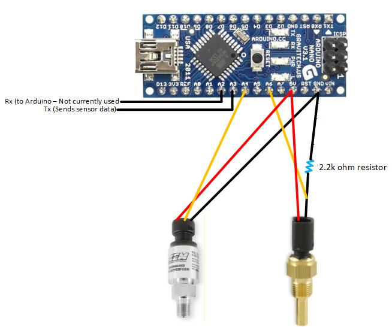

# AEM Sensors Arduino 2.0
Newer version of the AEM sensor data serial channel, this is used in teensyport 2.0 and uses different pins

This Arduino project is used to directly connect AEM oil pressure and temperature sensors and read their values.  Used to send the results via software serial to a seperate device.  Yes, the format used in sending is ugly, but it sucks sending comma seperated numbers at once.  A string based send is implemented but currently commented out while I work on the receiver side.

Due to the weird curve of the resistance readings at the extremes, the lower and upper limit areas are just a bunch of map() functions, while the center is a polynomial function.  I was unable to get a good function that could handle the entire range of temperatures I expect to see with the sensor.

## Wiring

